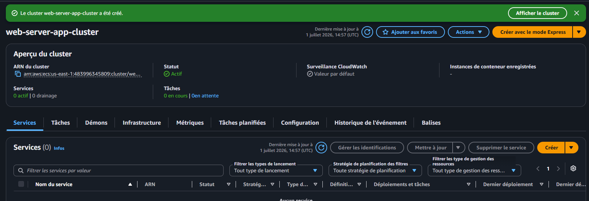
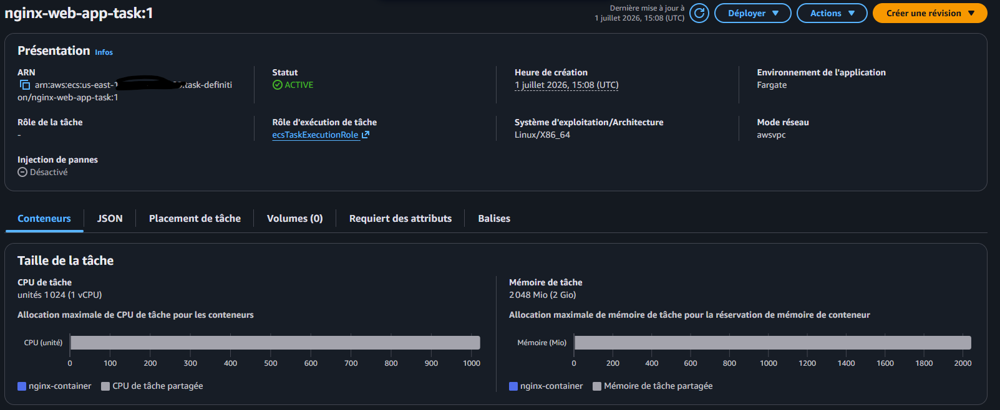
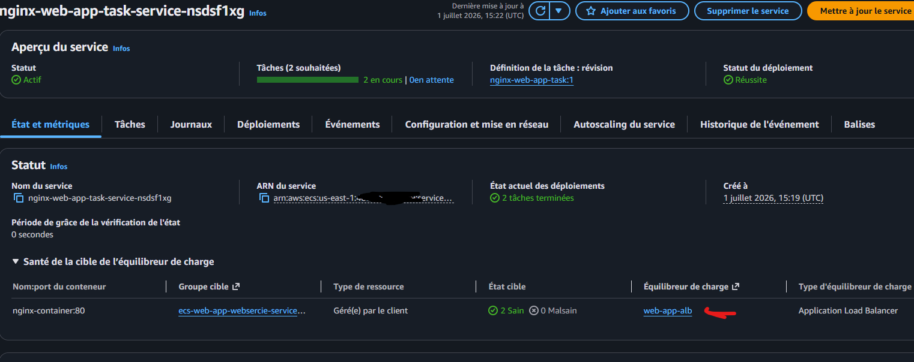

## Architecture 

# Taches

* Creer un cluster ECS
   
* Creer une task Definition avec 1 conteneur nginx
         
* Deployer un service ECSavec 1 ALB
         
* Tester laconnexion via l'ALB
   
* Explorer la gestion des tasks par le service ECS
* Nettoyer les ressources