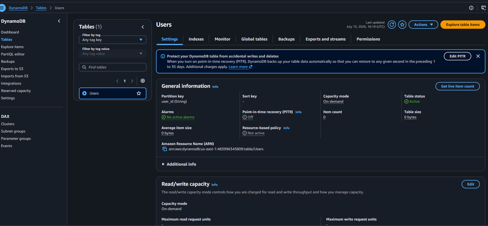
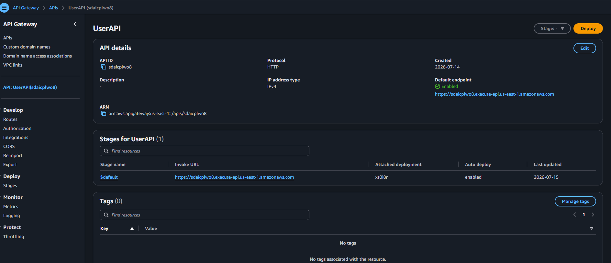
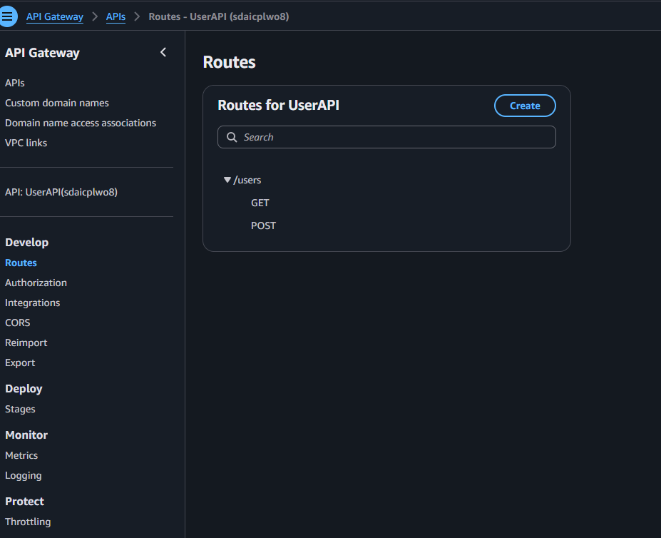
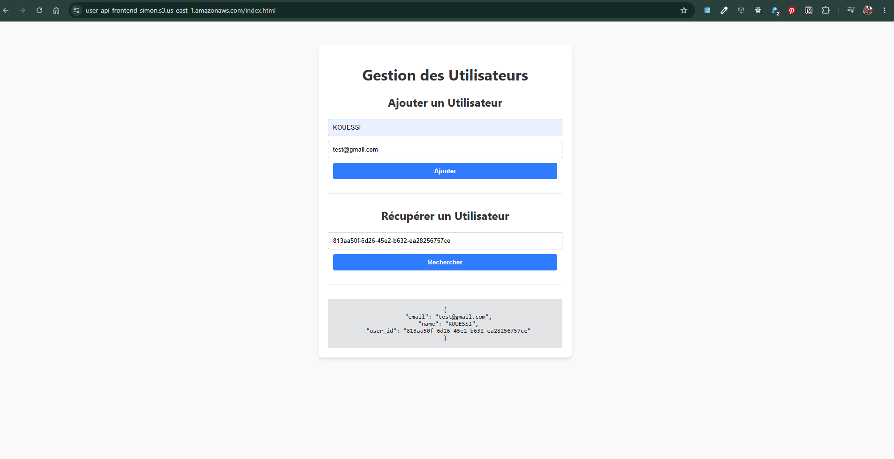

✅ Créer une API REST avec Lambda et DynamoDB.
✅ Déployer une interface web statique sur S3 pour tester l’API.

1. Architecture du Lab
- Amazon DynamoDB pour stocker les utilisateurs.
- AWS Lambda (Python) pour gérer les opérations CRUD.
- Amazon API Gateway pour exposer l’API REST.
  
    

  

  

- Bucket-policy readOnly-Acess

{
    "Version": "2012-10-17",
    "Statement": [
        {
            "Sid": "PublicReadGetObject",
            "Effect": "Allow",
            "Principal": "*",
            "Action": "s3:GetObject",
            "Resource": "arn:aws:s3:::votre-nom-de-bucket/*"
        }
    ]
}

  

 