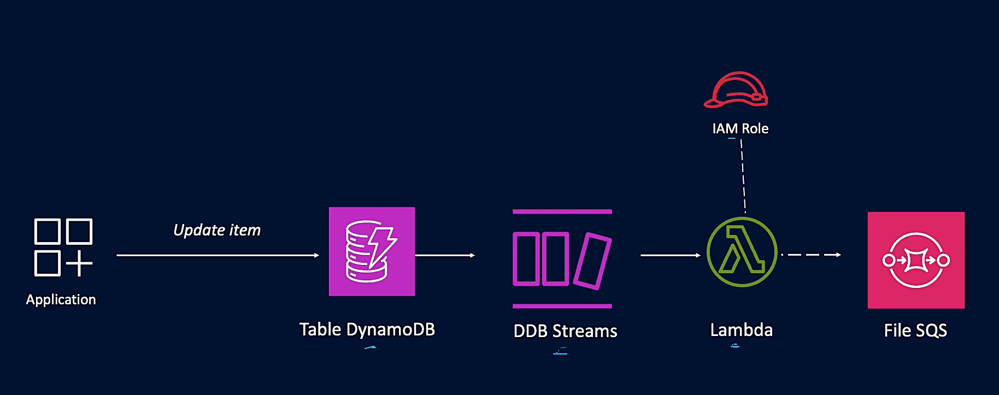

## Architecture
 

# Taches
* Utiliser les templates cloudformations pour deployer les ressources
* Explorer les ressources crees : table DynamoDB, Role IAM, file SQS, Fonction Lambda
* Activer et configurer DynamoDB Streams sur une table DynamoDB.
* Déclencher une fonction AWS Lambda lorsqu’un changement est détecté dans la table.
* Stocker les événements dans Amazon S3 ou les afficher dans CloudWatch Logs.
* Envoyer les événements capturés à une file Amazon SQS.
* Nettoyer les ressources