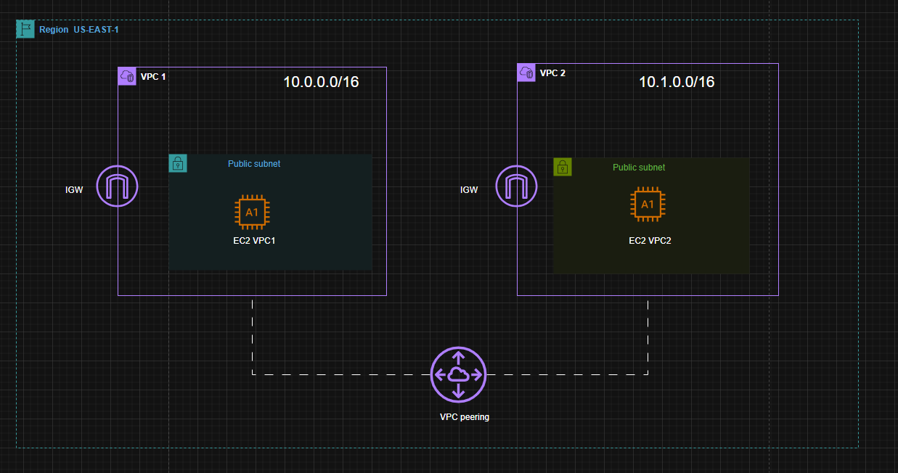

# Lab VPC Peering

  * Explorer le template CloudFormation
  * Creer 2 VPC avec 2 EC2 avec AWS CloudFormation
  * Mettre en place le VPC peering entre VPC1 et VPC2
  * Mettre a jour les tables de routage
  * Se connecter ensuite a EC2 dans VPC1
  * Tester la connectivite vers EC2 dans VPC2
  * Nettoyer les ressources

  # Architecture AWS: VPC peering

  

