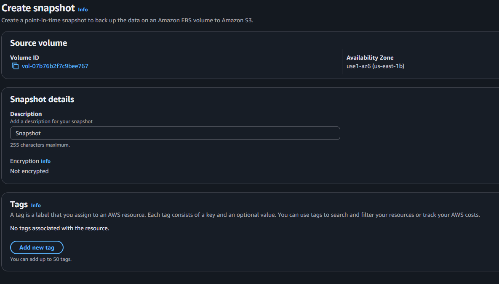

## Creation manuelle de snapshot et volume

* Creer un instance ec2
    
* Verifier la creation du volume snap creer a partir du snapshot racine

* Creer un autre snapshot a partir du volume racine
* Creer un volume a partir du snapshot (date specifique)